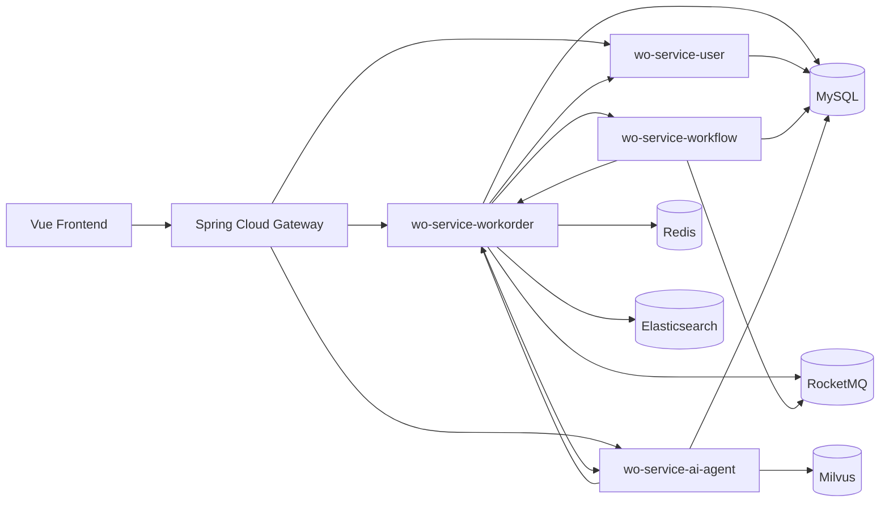
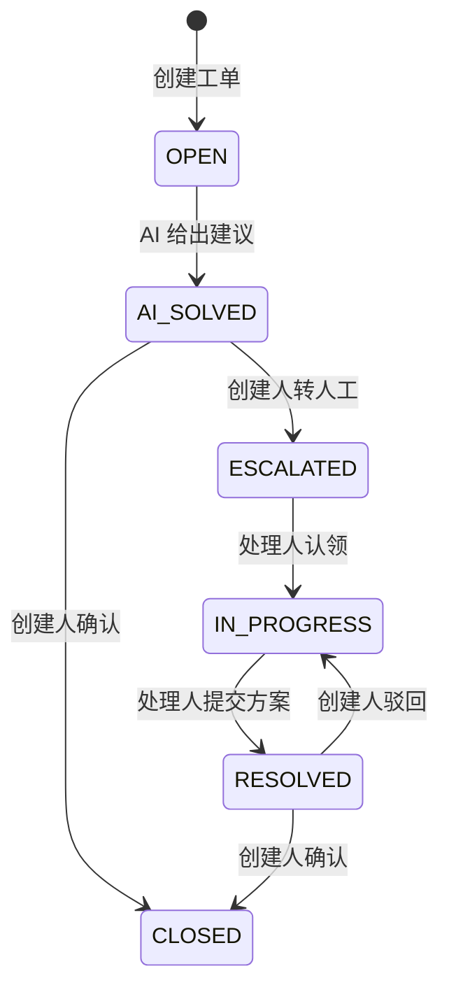
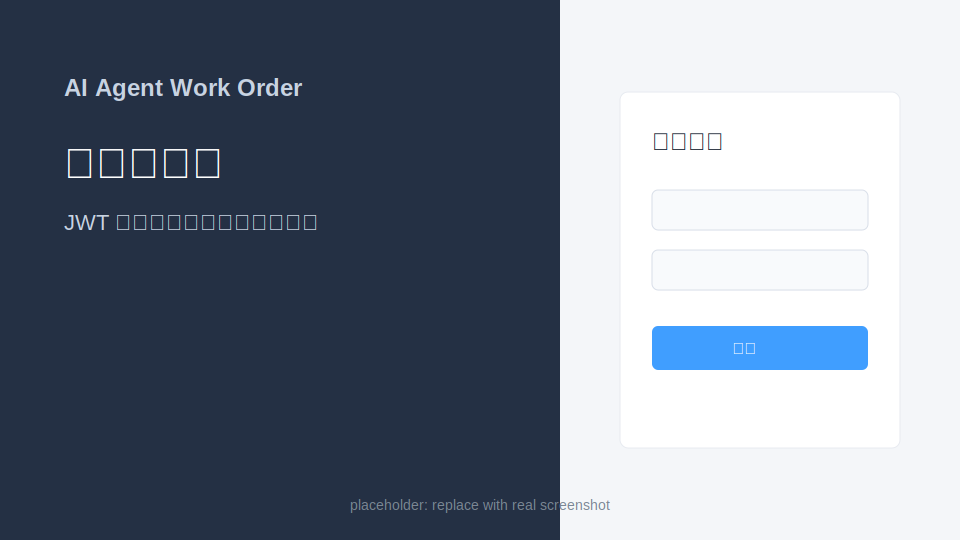
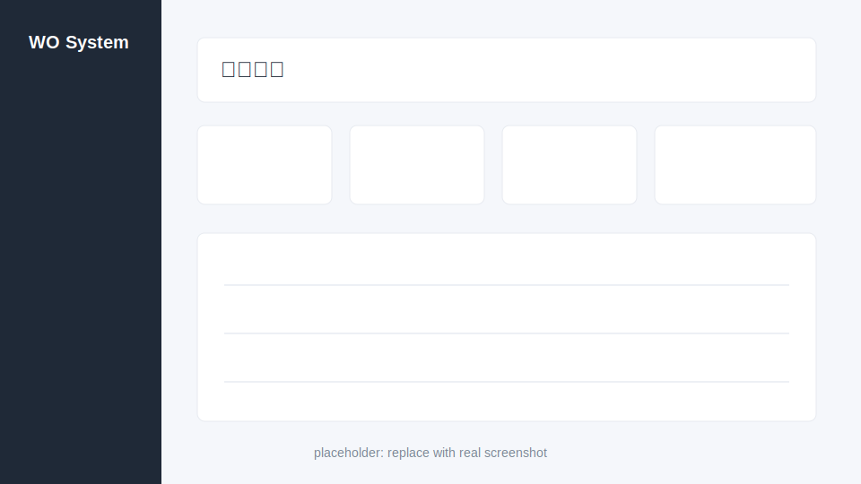
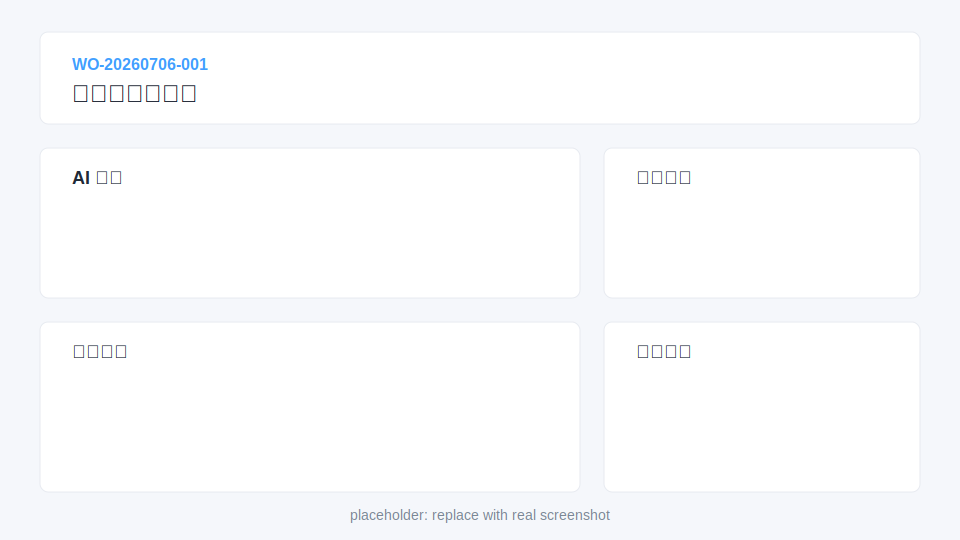
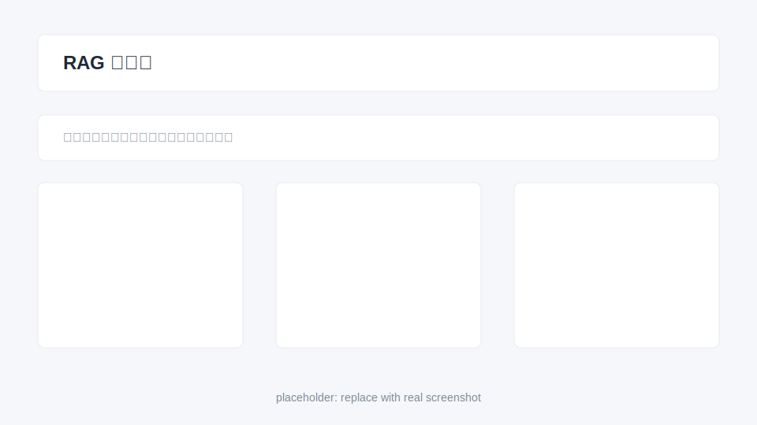

# AI Agent 工单系统

一个面向企业内部 IT/业务支持场景的智能工单系统，基于 Spring Cloud 微服务架构实现工单创建、AI 分析、人工流转、评论协作、附件元数据、SLA 超时升级、知识库沉淀和角色权限控制。

## 项目亮点

- 微服务拆分：Gateway、User、WorkOrder、Workflow、AI Agent、公共契约模块职责清晰。
- 鉴权与权限：JWT 登录、网关统一鉴权、服务间内部 Token、工单对象级权限控制。
- 工单闭环：创建、AI 处理、转人工、认领、解决、驳回、关闭、评论、附件、流转记录。
- Workflow 引擎：状态流转规则存储在 `wf_transition`，支持角色校验和可配置状态机。
- AI 能力：接入 DashScope，结合 Milvus RAG 知识库检索历史经验。
- 工程化：Docker Compose、统一响应/异常、单元测试、接口联调用例、启动部署文档。

## 技术栈

| 分层 | 技术 |
| --- | --- |
| 前端 | Vue 3, Vite, Element Plus, Axios |
| 网关 | Spring Cloud Gateway, JWT Filter, Sentinel |
| 后端 | Spring Boot 3, Spring Cloud Alibaba, OpenFeign, MyBatis-Plus |
| 数据 | MySQL, Redis, Elasticsearch, Milvus |
| 消息/任务 | RocketMQ, Spring Scheduler |
| AI | DashScope, RAG, Embedding |
| 部署 | Docker, Docker Compose |

## 架构图



## 核心流程



## 截图位

真实截图建议在本地启动后替换 `docs/screenshots/*.png`。当前仓库提供 SVG 占位图，方便 README 结构完整。

| 登录 | 看板 |
| --- | --- |
|  |  |

| 工单详情 | 知识库 |
| --- | --- |
|  |  |

## 快速启动

### 1. 准备环境

- JDK 21
- Maven 3.9+
- Node.js 18+
- Docker Desktop / Docker Engine

复制环境变量文件：

```powershell
copy .env.example .env
```

如需启用真实 AI，设置：

```text
DASHSCOPE_API_KEY=你的 DashScope Key
```

### 2. 启动基础设施

```powershell
docker compose -f docker\docker-compose-infra.yml up -d
```

### 3. 启动后端

开发时可以在 IDEA 中分别启动：

- `wo-gateway`：8080
- `wo-service-user`：8081
- `wo-service-workorder`：8082
- `wo-service-workflow`：8083
- `wo-service-ai-agent`：8084

也可以先打包：

```powershell
mvn package -DskipTests
```

### 4. 启动前端

```powershell
cd wo-frontend
npm install
npm run dev
```

访问：

```text
http://localhost:3000
```

## 测试账号

初始化脚本位于 `docker/mysql/init/02-data.sql`。

| 用户名 | 密码 | 角色 | 说明 |
| --- | --- | --- | --- |
| admin | admin123 | ADMIN | 管理员 |
| zhangsan | admin123 | AGENT | 技术部处理人 |
| lisi | admin123 | AGENT | 客服/运营处理人 |
| wangwu | admin123 | USER | 普通提交人 |
| zhaoliu | admin123 | MANAGER | 部门经理 |

## 常用验证命令

后端测试：

```powershell
mvn test
```

前端构建：

```powershell
cd wo-frontend
npm run build
```

接口联调：

```text
docs/api-tests/workorder-system.http
```

可以用 IntelliJ HTTP Client 或 VS Code REST Client 直接执行。

## API 示例

统一入口通过 Gateway：

```text
POST /api/auth/login
GET  /api/workorders
POST /api/workorders
GET  /api/workorders/{id}
PUT  /api/workorders/{id}/status
PUT  /api/workorders/{id}/reject
GET  /api/workorders/{id}/comments
POST /api/workorders/{id}/comments
GET  /api/workorders/{id}/flows
POST /api/ai/chat
POST /api/ai/knowledge/search
```

统一响应格式：

```json
{
  "code": 0,
  "message": "success",
  "data": {}
}
```

## 面试展示建议

1. 先讲业务闭环：提交人创建工单，AI 先给建议，无法解决再转人工。
2. 再讲权限设计：管理员、经理、处理人、提交人看到和能操作的工单不同。
3. 接着讲工程化：网关统一鉴权、服务间 Token、状态机由 Workflow 服务校验。
4. 最后讲 AI 亮点：RAG 检索历史工单，关闭工单后沉淀知识库。

更多话术见 [docs/portfolio-guide.md](docs/portfolio-guide.md)。

