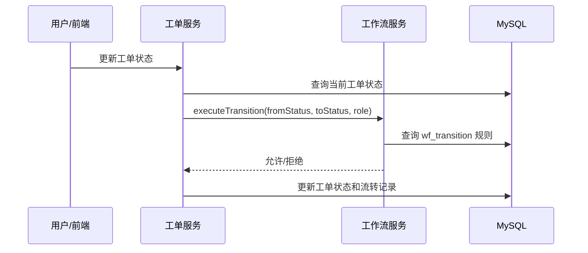
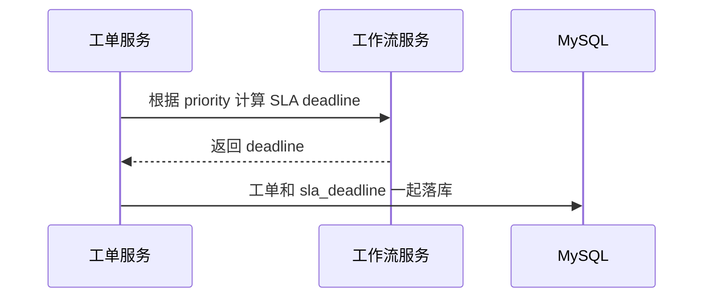
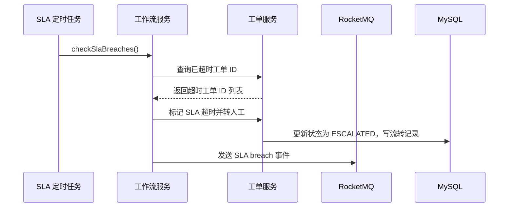

# 架构优化说明

本文档解释本次架构优化做了什么、为什么要这么做，以及面试时可以如何讲清楚。

## 1. 原来的问题

项目原来已经有很多企业级组件：工单服务、工作流服务、AI Agent、ES、RocketMQ、SLA 定时任务等。但有三个地方还停留在“模块存在”阶段：

1. 工单状态流转规则写在工单服务里。
2. 工作流服务有状态机引擎，但没有真正接入工单主流程。
3. SLA 服务只记录日志，没有形成“分配 deadline -> 扫描超时 -> 自动升级”的闭环。

这会导致面试官追问时出现一个问题：技术名词很多，但核心业务链路没有真正串起来。

## 2. 优化目标

本次优化的目标不是重写系统，而是让架构职责更清晰：

- 工单服务负责工单数据、流转记录、ES 索引和工单业务落库。
- 工作流服务负责状态流转规则、角色校验、SLA 规则和 SLA 超时扫描。
- `wo-api` 作为服务间契约层，统一 Feign 调用 DTO 和接口路径。

优化后，工单服务不再自己硬编码“哪些状态能转哪些状态”，而是调用工作流服务判断。

## 3. 状态流转优化

### 优化前

工单服务内部用 `switch` 判断状态：

```text
OPEN -> IN_PROGRESS
IN_PROGRESS -> RESOLVED
RESOLVED -> CLOSED
```

这种写法的问题是：

- 规则散落在业务代码里，后续修改流程要改代码。
- workflow 服务虽然存在，但没有承担核心职责。
- 面试讲“动态工作流”时，代码支撑不够。

### 优化后

工单服务更新状态前，会构造 `TransitionRequest` 调用 workflow 服务：



这样做的好处：

- 状态规则集中在工作流服务和 `wf_transition` 表。
- 工单服务只关心业务数据怎么落库。
- 后续想调整流程，可以改规则数据，而不是到处改业务代码。

## 4. SLA 优化

### 优化前

SLA 服务里有 `assignSla` 和定时任务，但主要是日志和注释：

```text
创建工单 -> 没有真正写入 SLA deadline
定时任务 -> 没有真正找超时工单
超时处理 -> 没有真正转人工
```

这会导致 SLA 在架构图里存在，但业务上没有闭环。

### 优化后

优化后分成两条链路。

创建工单时：



定时扫描时：



这里有一个重要设计点：创建工单时没有让 workflow 服务再回调工单服务写 deadline，而是让 workflow 只返回计算结果，由工单服务在自己的事务里落库。

原因是：如果工单服务在创建事务未提交时同步调用 workflow，而 workflow 再回调工单服务更新同一条工单，另一个数据库连接可能读不到未提交的数据。让 workflow 只计算 deadline，可以避免这个事务边界问题。

## 5. 服务职责边界

| 模块 | 优化后的职责 |
| --- | --- |
| `wo-service-workorder` | 工单创建、查询、状态更新、流转记录、SLA deadline 持久化、超时转人工落库 |
| `wo-service-workflow` | 状态流转规则校验、角色校验、SLA 规则计算、SLA 超时扫描调度 |
| `wo-api` | Feign 接口和 DTO 契约 |
| `RocketMQ` | 传递工单状态变化、SLA 超时等事件 |

这个边界更接近真实企业系统：业务服务管理业务数据，规则服务管理规则判断。

## 6. 本次代码改动概览

### 工作流契约统一

`wo-api` 中的 `TransitionRequest` 和 `TransitionResult` 现在能表达：

- 当前状态 `fromStatus`
- 目标状态 `toStatus`
- 事件 `event`
- 操作人 `operatorId`
- 操作角色 `operatorRole`

Feign 路径也统一到：

```text
POST /api/workflow/transitions/execute
```

### 工单服务接入工作流

工单状态更新前会调用 workflow 服务校验：

```text
WorkOrderServiceImpl.updateStatus
  -> workflowClient.executeTransition
  -> 校验通过后更新工单状态
```

### SLA 闭环补齐

新增能力：

- workflow 根据优先级计算 SLA deadline。
- 工单创建时保存 `sla_deadline`。
- workflow 定时扫描 SLA 超时。
- 超时后工单服务标记为 `ESCALATED`，并写入流转记录。
- workflow 发送 `sla-breach-topic` 事件。

### 初始化规则补齐

`02-data.sql` 中的默认工作流规则已和当前工单状态对齐：

- `OPEN -> IN_PROGRESS`
- `OPEN -> ESCALATED`
- `AI_SOLVED -> CLOSED`
- `AI_SOLVED -> ESCALATED`
- `ESCALATED -> IN_PROGRESS`
- `IN_PROGRESS -> RESOLVED`
- `RESOLVED -> CLOSED`

## 7. 面试讲法

可以这样介绍：

> 这个项目一开始工单状态流转是写在工单服务里的，虽然有 workflow 模块，但没有真正参与主流程。后来我把状态流转抽到 workflow 服务，由工单服务在更新状态前通过 Feign 调用 workflow 做规则校验。这样工单服务只负责数据落库，workflow 服务负责规则判断，后续调整流程时可以改规则表，而不是改业务代码。

讲 SLA 时可以这样说：

> SLA 不只是一个字段，而是一条闭环链路。创建工单时，workflow 根据优先级规则计算 deadline，工单服务在同一事务里保存。workflow 的定时任务扫描超时工单，调用工单服务转入人工升级状态，并发送 RocketMQ 事件。这样 SLA 从“配置规则”变成了实际能驱动业务状态变化的能力。

## 8. 后续还能继续优化什么

本次优化是架构闭环的第一步。后续还可以继续做：

- workflow 规则管理页面，支持动态新增状态流转。
- SLA 超时事件增加幂等表，避免重复升级。
- workflow 调用失败时引入重试或本地降级规则。
- 工单状态更新增加乐观锁，避免并发流转覆盖。
- 使用事务消息或 outbox pattern 保证数据库更新和 MQ 事件一致性。
